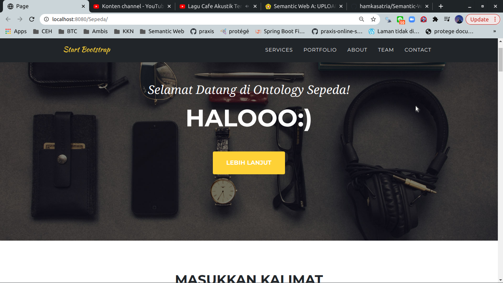
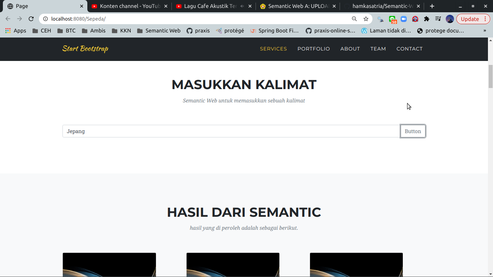
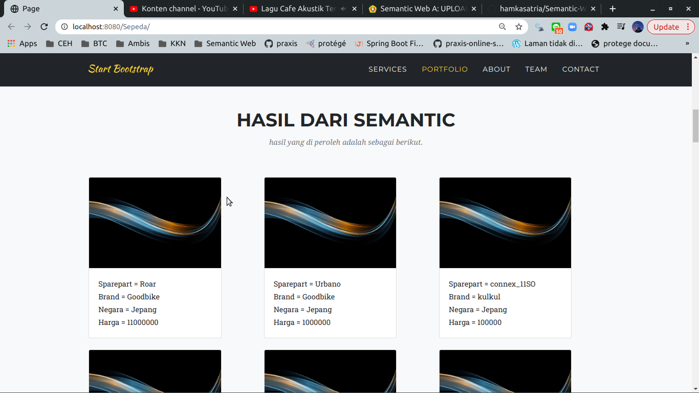

# Semantic-Web

## Tools yang digunakan
###    - Protege untuk membuat file owl
###    - Java versi 8
###    - Jena library
###    - Glassfish server
###    - Bootstrap framework

## Berikut merupakan gambar dari interface web ontologi sepeda

